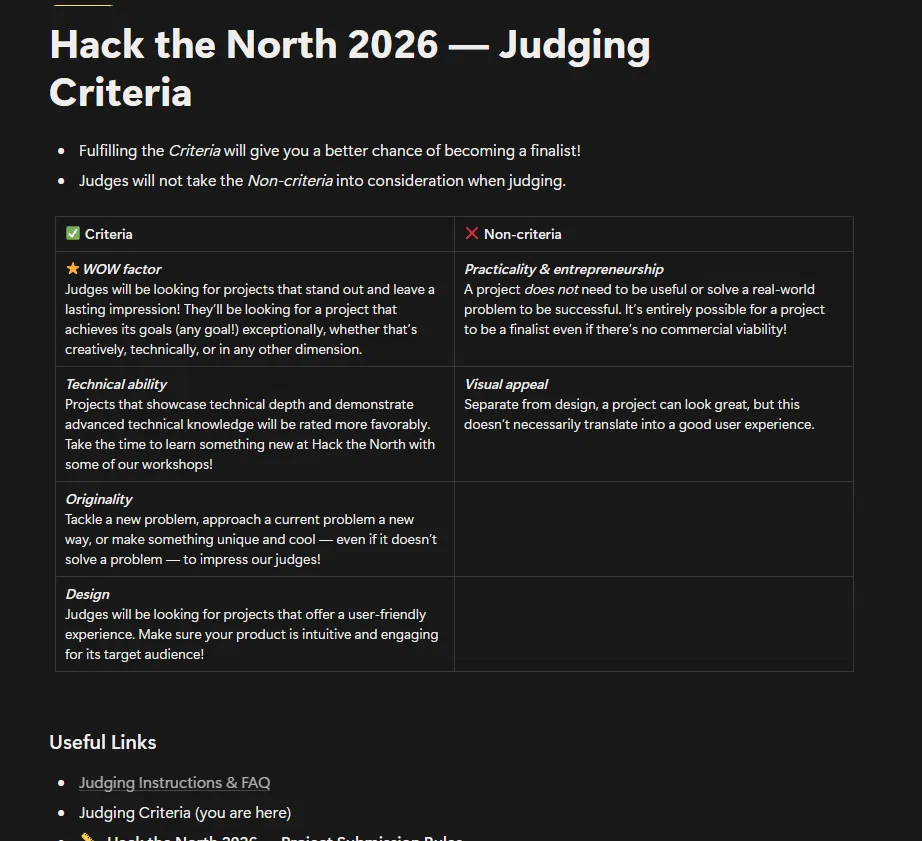

# CLAUDE.md

This file provides guidance to Claude Code (claude.ai/code) when working with code in this repository.

---

## Read this before trusting anything below

**Everything from `# MISE — Master Build Spec` onward is the original hackathon master spec. It
describes a Quest 3S / IWSDK / Havok cooking simulation whose code is NOT in this repository.**

That spec is **doctrine, not description**. Its numbered rules (§17) still govern. Its
architecture, file paths and §14 repo layout do not exist here — §14 is 0% accurate; none of
`src/systems/`, `src/physics/`, `src/meshes/`, `src/perception/`, `src/shaders/`, `src/sim/`,
`src/xr/`, `harness/`, `server/routes/` or `spectator/` is present.

The correction is `DECISIONS.md` entry 12, which sits at line 272 of a 408-line file — after
eleven entries a reader has already taken as description. Do not read entries 1–11 as current.

## What is actually here

Two live builds and one absent one.

| Path | What | State |
|---|---|---|
| `src/` | Browser + webcam slice-measurement app. TypeScript, OpenCV.js | Runs. 196 tests |
| `unity/` | Quest 3/3S MR perception app. C#, OpenXR, OpenCV for Unity | **Never compiled** |
| `server/` | One file: an OpenAI relay for the Unity app | Runs |

`README.md` says *"Not built: … anything XR"*. **That is wrong** — `unity/` landed in the same
commit. Treat `unity/README.md` as authoritative for that half of the repo.

**`unity/` is not an openable Unity project.** It contains `Assets/Scripts/Perception/` and
nothing else — no `ProjectSettings/`, no `Packages/manifest.json`, no `.meta` files, no scenes,
no `StreamingAssets/` (despite `unity/README.md` telling you to put `yolov8n.onnx` there). The
scripts are copied into a Unity project you create yourself.

## Commands

All verified. Run from the repo root — `check:purity` resolves `src/core` relatively and throws
`ENOENT` from anywhere else.

```bash
npm ci                  # first install is slow: OpenCV + Tesseract WASM payloads
npm test                # THE FULL GATE: check:purity && typecheck && 196 tests
npm run test:core       # fast inner loop, 177 tests, skips the purity-guard suite
npm run check:purity    # layering only, instant
npm run typecheck       # tsc --noEmit
npm run dev             # 0.0.0.0:8081 -- LAN-visible on purpose, Windows firewall will prompt
npm run build           # -> dist/, base './' so it works from any subpath
```

Single test file, and a single test by name:

```bash
npx vitest run src/core/track.test.ts
npx vitest run src/core/track.test.ts -t "treats a stub that got longer as a bad baseline"
```

**`-t` with a pattern that matches nothing exits 0 with everything skipped.** A typo'd name is
indistinguishable from a pass. Read the `N passed` line, never the exit code.

The relay (Unity only — the web app never calls it). PowerShell, since the header comment in the
file itself is bash-only:

```powershell
$env:OPENAI_API_KEY = "sk-..."; node server/vision-relay.mjs   # :8787
```

No linter, no formatter, no CI. `npm test` is the entire quality gate and it is manual.

## Architecture

### `src/core/**` is framework-free, and this is enforced

No `three`, `@iwsdk`, `@babylonjs` or `@dimforge` import may appear under `src/core`.
`npm run check:purity` fails the build on one, and the guard is itself tested
(`scripts/purity-rules.test.mjs`, 19 cases) because "an untested guard is worse than no guard".

The dependency arrow points **only inward**: `src/main.ts`, `src/vision/*`, `src/audio/*` all
import from core; nothing in core reaches out. Every intra-core edge is `import type`, so with
`verbatimModuleSyntax` they erase entirely at compile time.

This is what makes the hard parts — coordinate math, cut detection, OCR voting — provable from a
terminal with no camera, browser or headset.

### The web render loop

`src/main.ts` `tick()`, once per `requestAnimationFrame`:

```
source() -> ImageData
  -> segment()          src/vision/segment.ts   OpenCV: HSV -> saturation threshold -> contours
  -> hue gate           filters to produce BEFORE tracking
  -> observe()          src/core/track.ts       stub tracking, cut detection
  -> recordCut()        src/core/metrics.ts
  -> scoreSession()     src/core/scoring.ts     runs EVERY frame, not just on a cut
  -> formatScore()      the headline string
```

**Option objects are rebuilt at their call sites every frame on purpose** (`segmentOptions()`,
`trackOptions()`, `scoringOptions()`, `feedbackOptions()`). Hoisting any of them into a `const`
outside `tick` is the single refactor that silently kills every slider at once.

`segment()` caches eight WASM Mats across frames keyed on `(width, height, kernelPx, satFloor)`.
Allocating them per frame cost ~250ms at 1080p **regardless of blob count** — the two `inRange`
bound Mats are ~6MB each and exist only because the JS binding takes Mats where C++ takes
Scalars. Never add a per-frame buffer without extending both the `Scratch` shape and its cache key.

### The Unity pipeline

```
WebCamTexture -> Graphics.Blit (GPU downscale) -> AsyncGPUReadback   [render thread, <1ms]
  -> Mat copy                                                        [main thread, ~2ms]
  -> YOLOv8n + Canny contours                                        [ONE worker thread]
  -> Depth API raycast, MRUK fallback                                [main thread -- Unity API]
  -> size + veto filters -> tracking -> RecipeRunner                 [main thread]
```

One worker, not a pool: an OpenCV `Net` is not re-entrant, and two concurrent inferences on a
mobile chip finish at the same time as each other, twice as late. The Mat is **copied** across
the boundary because the feed reuses its buffer every capture.

`CapturedFrame` carries the camera pose from the moment of the Blit. Using the live pose instead
puts holograms 10–17cm out at 1m after a readback plus inference, which reads as broken tracking.

### The two hysteresis layers lean opposite ways, deliberately

This is the most important design conversation in the tree, and the two headers cross-reference
each other:

- **`src/core/track.ts`** — slow to confirm, cheap to miss. A false cut is written permanently
  into the score, sigma and leaderboard. Eight rejection reasons gate a candidate; an increase is
  never a cut, only a corrected baseline.
- **`src/core/perception/tracking.ts`** — slow to appear, **slower to disappear**. Nothing is
  scored; the failure is a label that blinks. `despawnMissFrames` (5) exceeds
  `spawnConfirmFrames` (3) on purpose, with two confidence thresholds so a wobbling detector
  lives in the band between them.

Porting one's tuning to the other inverts the risk model. Read both headers before touching
either set of constants.

### Absent is never zero

Stated and cross-cited in eight modules. `null` for a result that could not be computed,
`undefined` for an unmeasured field of an otherwise-valid record. A sentinel is treated as a lie:
defaulting an unmeasured cut angle to zero would score every slice the camera could not judge as
a flawless square cut, inflating the score in the one direction nobody would question.

Every constructor refuses rather than coerces — `calibrate()`, `identify()`, `entryFrom()`,
`parseEntries()`, `setTunable()` all return null or ignore bad input.

The one deliberate exception is `median([])` returning `NaN`, pinned by a test: NaN is the
internal poison value, `null` is the exported one.

### Magic numbers live in a registry

`src/core/tunables.ts` (web) and `PerceptionTunables.cs` (Unity). Both generate their debug panel
from the table and are read on **every** use. A cached read makes the slider look broken, which
is worse than having no slider because you then debug the wrong thing.

Changing a default that a document argues for breaks `tunables.test.ts` deliberately — update the
rationale in the same commit.

## Known traps

Verified, in rough order of how much time they cost:

- **`src/core/perception/**` and `src/vision/ocr*.ts` are unreachable from the running app.**
  Six modules, ~500 lines, 60 tests, zero consumers. They are a portable library staged for the
  headset. `tesseract.js` ships in the bundle for nothing.
- **There are two `useOpenCv` functions** — `segment.ts:33` and `ocrPrep.ts:35`. `main.ts` only
  calls the first. Wiring up `prepareCrop()` gets "OpenCV is not loaded" from the file you are
  not looking at.
- **The scoring sliders are dead whenever a ticket is selected.** `scoringOptions()` prefers
  `activeRecipe?.…`, so `TARGET_THICKNESS_MM`/`TOLERANCE_MM`/`TARGET_SIGMA_MM` do nothing.
  `ANGLE_TOLERANCE_DEG` is inert always — nothing measures cut angle.
- **`DEFAULT_TRACK_OPTIONS.refractoryFrames` is 15; the registry says 5.** The registry is right
  and production reads it. `DEFAULT_TRACK_OPTIONS` is a hand-maintained duplicate with nothing
  pinning their agreement.
- **`modes.value = x` fires no `change` event.** Dropping a clip leaves the scrub bar hidden
  because the `.shown` toggle only happens in the listener.
- **`check:purity` cannot catch a relative escape.** `import { segment } from '../vision/…'`
  inside `src/core` reports "purity OK" — the exact inversion its own failure message forbids.
- **`tsconfig.json`'s `"scripts"` include is a no-op** (no `allowJs`, all `.mjs`), so the purity
  checker is never typechecked. `server/` is not in `include` at all.
- **`status()` outside `tick` is invisible** — the status line is rewritten every frame.
- Node 23 is excluded by the engine range, but `engine-strict` is off, so it warns rather than
  fails.

### Unity-specific

None of the C# has been compiled — there is no Unity, Meta XR SDK or OpenCV for Unity on this
machine. Brace balance is verified mechanically, which is not the same as compiling. Two real
compile errors were caught that way; expect API drift on first build, most likely
`PassthroughCameraUtils`, `EnvironmentRaycastHit.normalConfidence` and the `OVRInput` constants.

The defects an audit found all shared one shape — **they work in the Editor and fail on the
device**:

- `Utils.getFilePath` returns empty on Android, because StreamingAssets lives inside the APK.
  YOLO never loaded and the app presented as bad at detecting food. Now resolved through
  `UnityWebRequest` into `persistentDataPath`. **Do not reintroduce it.**
- `Shader.Find` resolves in the Editor and returns null in a build, because Unity strips
  unreferenced shaders. All material creation goes through `UnlitMaterials`, which returns
  null rather than throwing. Add an unlit shader to Always Included Shaders before shipping.
- `Input.GetKey` under `#if UNITY_EDITOR` throws if the project uses the new Input System.
- `OVRInput` silently returns zero with no `OVRManager` in the scene, so the debug panel
  renders perfectly and does nothing.

Known and deliberately unfixed: `MedianOf` leaks four native Mats per call; the per-inference
`float[8400*84]` is a 2.8MB allocation that should be reused; `Utils.matToTexture2D` flips by
default on most versions, so identification crops are probably upside down; and `_workerMat` is
paired with its results only by the capture rate being slower than inference, which a runtime
slider can close.

`yield break` inside a `catch` is legal C#. Do not "fix" it.

## Which documents to trust

| Trust | Document |
|---|---|
| Authoritative for `unity/` | `unity/README.md` — verified against all 18 `.cs` files |
| Authoritative for `src/` | `DECISIONS.md` entries **12–15** |
| Right about `src/`, wrong about `unity/` and the test count (says 136, actual 196) | `README.md` |
| Accurate only where it covers `src/core/perception` and `src/vision`; §6 is source for files that do not exist, and says so | `docs/MR-PERCEPTION.md` |
| Doctrine only — rules survive, architecture does not | this file below, `DECISIONS.md` **1–11** |
| Historical | `PHYSICS.md`, `docs/superpowers/**` |

Of `PHYSICS.md`, only the **Thickness** section is still live (axial vs perpendicular,
`thickness = axialDelta · cos(angle)`) — that is what `metrics.ts` implements. Nineteen of its
twenty constants are asserted *absent* by `tunables.test.ts`, which exists to stop them coming
back.

**`docs/superpowers/` contains two unmarked frozen copies of documents that have since been
corrected** — the embedded DECISIONS entry 5 and `PHYSICS.md` inside
`plans/2026-09-18-mise-simulation-core.md`. Both still assert that `PhysicsShape.density` is
g/cm³ and instruct a `/1000` conversion. That conclusion was measured against Havok and
disproved; acting on it makes every mass a thousand times too light. Do not act on anything in
those three files.

## Of the master spec's §17 rules, these still apply

**#3** vertical slices · **#4** confirmation and hysteresis before anything cosmetic ·
**#9** every network call gets a timeout and a fallback · **#10** never block the render loop ·
**#11** every magic number on a live slider · **#12** when ambiguous, pick what survives a live
demo on bad wifi · **#13** do not fabricate sponsor integrations · **#15** log every deviation in
`DECISIONS.md`.

Void: **#1** (IWSDK), **#2** (phase gates), **#5**/**#6** (physics solvers), **#7** (procedural
meshes — the food is real now), **#8** (`FoodThermalProfile` — the principle survives as the
tunables registry). **#14** is half-void: the habit of marking constants `TUNED, not sourced` is
alive, but `PHYSICS.md` is no longer a valid destination for new ones.

**Rule #15 is currently breached** — the Unity/OpenXR pivot has no `DECISIONS.md` entry.

---

# MISE — Master Build Spec
### Hack the North 2026 · Meta Quest 3S · 4 people · ~36 hours

> Drop this in the repo root as `CLAUDE.md`. Read it fully before writing any code.
> This supersedes `MISE_BUILD_SPEC.md` and `MISE_FEATURES.md`.
> Working name **MISE** (as in *mise en place*). Do not ship the name "Papa's Cookeria";
> it sits too close to Flipline Studios' "Papa's ___eria" series for a public Devpost page.

**Appendices:** A — links and sponsor credentials · B — the rubric verbatim ·
C — hardware inventory

---

## 1. WHAT WE ARE BUILDING

A mixed reality cooking trainer on Quest 3S with **two disciplines**, both built deep.

**Discipline A — Knife work.** You cut a real cucumber on a real board with a real blunt
blade that has a Touch Plus controller mounted to it. The game projects a glowing target line
onto the real cucumber, predicts your slice thickness before you commit, and measures what you
actually cut to within a millimetre using the passthrough camera.

**Discipline B — Heat.** A real pan sits on the table, cold and safe. Virtual food cooks in it
under a **real thermodynamic simulation**: transient heat conduction, convective boundary
transfer, Arrhenius browning kinetics, evaporative cooling, protein denaturation. You can cut
the virtual steak open and see the actual temperature gradient.

A theatrical chef, built as an ElevenLabs voice agent with tool access to live game state, runs
the kitchen.

### The one-sentence pitch

> "It is a mixed reality cooking trainer that measures your real knife cuts to the millimetre
> and simulates real heat-transfer physics, so you can cut a steak open and see the temperature
> gradient that made it grey."

### The governing design rule

**Real objects are the ones you touch. The virtual layer is the physics you cannot see.**

| Real | Virtual | Why |
|---|---|---|
| Cutting board | Target lines, thickness preview | Anchor plus invisible geometry |
| Cucumber | Cut guides, measurement overlay | Material genuinely cuts under a blunt blade |
| Blunt blade + controller | Blade glow, path ribbon | Real resistance, exact 90Hz pose |
| Pan (cold) | Food, heat map, browning | Heat is invisible and cannot be taught otherwise |
| Spatula | Contact feedback | Real weight in hand |
| Plate | Composition scoring | Zero risk, pure Gemini |

Remove passthrough and none of it works. That is the test for whether this is genuinely MR.

---

## 2. THE RUBRIC, READ LITERALLY

*Full verbatim text and the criterion-to-feature map: **Appendix B**.*

| Scored | **Not** scored |
|---|---|
| **WOW factor** — stands out, lasting impression, achieves any goal exceptionally | **Practicality and entrepreneurship** — commercial viability explicitly not required |
| **Technical ability** — depth, advanced technical knowledge | **Visual appeal** — looking great does not equal good UX |
| **Originality** — new problem, new approach, or just unique and cool | |
| **Design** — intuitive and engaging for its target audience | |

Three consequences that change what we build:

1. **Do not argue commercial viability.** It is a non-criterion. The physics engine is in
   because it is technically deep, not because it is useful.
2. **Do not spend hours on photoreal food.** Visual appeal is a non-criterion. Those hours go
   into interaction clarity, which is scored under Design.
3. **One thing done exceptionally beats six done shallowly.** The rubric says "achieves its
   goals (any goal!) exceptionally." Two deep disciplines, not six thin ones.

---

## 3. GATE ZERO — before any code

Do not write game code until this passes. Budget 15 minutes. If it takes 30, take the fallback.

Put on the 3S, open Quest Browser, connect the laptop with `adb reverse tcp:5173 tcp:5173`,
open `chrome://inspect` from the laptop, and run:

```js
const stream = await navigator.mediaDevices.getUserMedia({
  video: { facingMode: 'environment', width: 1280, height: 960 }
});
const devices = await navigator.mediaDevices.enumerateDevices();
console.log(devices.filter(d => d.kind === 'videoinput').map(d => d.label));
const v = document.createElement('video');
v.srcObject = stream; v.autoplay = true; v.playsInline = true;
document.body.appendChild(v);
```

**PASS** → you see the room. Single-device architecture confirmed. Proceed.

**FAIL** → Quest does not expose passthrough to `getUserMedia`. Fall back to the **Luxonis
OAK-1 AI Kit** (38 available at the hardware table) on a static stand over the board. This is
actually *easier*: a static camera means a fixed 4-point homography instead of pose-synced ray
unprojection, and the OAK-1 runs YOLO on-device over USB. Nothing else in this spec changes,
because the headset app does not care where detections come from.

### Why this gate exists

WebXR's `camera-access` feature descriptor is **not** implemented in Quest Browser. IWSDK
reaches the cameras through the **MediaDevices API** instead (`getUserMedia`), which on Horizon
OS sits on Camera2, which has exposed the passthrough cameras since v74. Different door, same
room. Meta's IWSDK camera-access guide was last updated 2026-09-04 and states the camera system
works while the IWSDK world is visible, including immersive XR sessions. It has not been
verified on your specific headset and OS build. Hence the gate.

---

## 4. HARDWARE AND PROPS

*Full filtered inventory with take/ignore rationale: **Appendix C**.*

### From the hardware table (P4 goes tonight, before stock runs out)

| Item | Qty | Why |
|---|---|---|
| **Meta Quest 3S + Touch Plus** | **2** | Second unit is a demo requirement, not a technical one. Judge plays while another watches. Also insurance against a bricked build at 4am. |
| **Titan Haptics Core Dev Kit** | 1 | 10 available, nobody competing. TacHammer in the blade handle beats built-in rumble. |
| **Luxonis OAK-1 AI Kit** | 1 | Gate-zero insurance only. Leave in the bag unless needed. |
| **Portable Charger** | 2 | A 3S dies in ~2h of heavy use. Keep both tethered. |

From QNX Makerspace (unlimited): modelling clay, duct tape, wooden dowels, popsicle sticks,
glue gun, markers.

**Ignore:** ZED 2, RPLidar, Kinect, Jetson, XREAL One (3DoF only, no camera without the
separately-sold Eye accessory, no hand tracking, no controllers — strictly worse than what you
have), XREAL Beam Pro.

### Bought or scavenged (under $25 total)

- **10 cucumbers** — hero cutting ingredient. Rigid, uniform cylinder, holds shape, cuts clean
  under a blunt press, green against a light board for contrast. You will destroy more than you
  expect across testing, rehearsal and judging. Do not plan a Sunday grocery run.
- **6 bananas** — backup, softest option, but deforms and browns within the hour.
- **1 bench scraper** (preferred) or butter knife — completely blunt, cuts cucumber in one
  downward press, is what real cooks use to portion dough, and is not a weapon.
- **1 cheap frying pan, 1 spatula, 1 white plate**
- **1 bag couscous** — seasoning uniformity mode.
- **1 light-coloured cutting board or white sheet** — segmentation contrast.
- Tray, paper towels, hand sanitizer, scrap bag. **A table that looks unsanitary at hour 30
  costs you more with judges than any feature gains.** Wipe the blade between judges, fresh
  cucumber each time. Four seconds, reads as professional.

### Do NOT bring a sharp knife

MLH's code of conduct prohibits weapons. A chef's knife will read as one to venue security at a
1500-person overnight event. Beyond that, a sharp blade makes the game *worse*: the controller
is what gives you 90Hz blade pose, which is what makes exact cut-plane scoring possible. You
would be trading your best technical argument for a prop.

### The blade prop (P4, ~1 hour)

Bench scraper or butter knife, Touch Plus controller mounted to the handle with a clay collar
and duct tape, Titan actuator inside the collar. Must be rigid: any wobble between blade and
controller becomes measurement error. Mark the blade tip and heel positions in controller local
space and put them in config as `BLADE_HEEL_OFFSET` and `BLADE_TIP_OFFSET`.

It looks right on camera, has genuine heft, keeps full tracking, and nobody can be injured.

---

## 5. ARCHITECTURE

**The camera identifies, the headset places.** Two jobs, wildly different latency budgets.
Conflating them is what makes MR demos feel broken.

```
┌──────────────────────────────────────────────────────────────────────┐
│ LAYER 1 — ON HEADSET, EVERY FRAME, 90Hz, ZERO NETWORK                │
│                                                                        │
│  Controller pose ────► blade segment, sweep, cut plane, ribbon        │
│  Hand tracking (26 joints) ──► claw grip, knuckle rail, whisk motion  │
│  Scene understanding ──► table plane, board anchor, pan anchor        │
│  Depth sensing ───────► real hands occlude virtual food               │
│  Haptics ─────────────► cut thump, pan contact                        │
│  PHYSICS SIM (200Hz) ─► conduction, Maillard, moisture, denaturation  │
│                                                                        │
│  Everything that must FEEL instant lives here. No camera, no network. │
└──────────────────────────────────────────────────────────────────────┘
                              │ world-space planes
                              ▼
┌──────────────────────────────────────────────────────────────────────┐
│ LAYER 2 — IDENTIFICATION + MEASUREMENT, ~1 Hz, CLOUD                  │
│                                                                        │
│  CameraUtils.captureFrame() ──► 640px JPEG + timestamped head pose    │
│       ├─► Baseten (YOLOE-26 open vocab) ──► boxes, labels, masks      │
│       └─► Gemini 3 Flash ──► state, plating score, specimen notes     │
│                                                                        │
│  stub length measurement ──► slice thickness delta (see §7.3)         │
│  detection pixel ──► pose-synced ray unproject ──► table plane hit    │
│                  ──► confirmation gate ──► world-anchored entity      │
└──────────────────────────────────────────────────────────────────────┘
                              │ board + pan state snapshot
                              ▼
┌──────────────────────────────────────────────────────────────────────┐
│ LAYER 3 — REACTION, ~0.3 Hz                                           │
│                                                                        │
│  ElevenLabs Agent (WebSocket) with client tools                       │
│  MongoDB Atlas: recipes, telemetry, leaderboard, vector search         │
└──────────────────────────────────────────────────────────────────────┘
```

### 5.1 Why the split works

A cucumber does not move between frames. A blade does. So the blade is tracked by the headset
at 90Hz with sub-millisecond latency, and the cucumber is measured by a cloud model at 1Hz.
Once you split the world by how fast things move, the latency problem dissolves. Even a
2-second round trip produces a game that feels instantaneous, because nothing that needs to
feel instant was ever waiting on it.

### 5.2 Non-negotiable constraints

1. **Never block a render frame** on inference or network. 72Hz floor. All detection in workers
   or fire-and-forget async. If you are about to `await` inside a system's `update()`, stop and
   restructure.
2. **The camera births entities, it does not hold them up.** Once identified and placed, an
   object is a normal world-anchored entity. Camera dies, wifi drops, hand covers the board:
   the game keeps running with everything exactly where it was.
3. **Fully playable with zero network.** Venue wifi will be saturated. Every cloud call has a
   timeout and a local fallback. Ship `--offline` and rehearse the demo in it.
4. **Keep the guardian boundary enabled.** Disabling it in developer mode makes passthrough
   render as **black** in recordings and casts. This silently destroys your demo video. Draw
   the guardian larger than the room so the grid stays out of frame.
5. **Performance budget, enforced every phase:** <150 draw calls, <300k triangles, 72Hz floor,
   90Hz target. Debug HUD showing `renderer.info` and frame time from hour one.
6. **Sponsor prize selection closes 2:00 PM EDT Saturday.** Select all eight Friday night.
7. **The judging pitch is a live demo, not a deck.**

---

## 6. TECH STACK

| Layer | Choice | Why |
|---|---|---|
| Framework | **IWSDK** (`@iwsdk/core`) 0.5.x | Meta's own WebXR framework. Three.js + ECS. Ships scene understanding, depth occlusion, physics, spatial UI, camera access. Has an agentic workflow tuned for Claude Code. |
| Language | TypeScript, `strict: true` | |
| Build | Vite | IWSDK default |
| Physics (rigid body) | Rapier via IWSDK | Slice fragments |
| Physics (thermal) | **Custom, see §8** | This is the technical centrepiece |
| Mesh slicing | `three-bvh-csg` + analytic fast path | §7.2 |
| Raycasts | `three-mesh-bvh` | Blade-vs-mesh |
| Desktop dev | **IWER emulator** | Develop without the headset. Critical for iteration speed. |
| Spatial UI | UIKitML (IWSDK) | |
| Open-vocab detection | **YOLOE-26** on Baseten Truss | COCO-80 lacks onion, bell pepper, garlic. YOLO26 is NMS-free, which removes the worst part of ONNX export. |
| Scene semantics | **Gemini 3 Flash** (`gemini-3-flash-preview`) | Structured JSON. State, plating, specimen notes |
| Parallel provider | **Huawei OMNI** cloud API | Same interface, second impl |
| Voice | **ElevenLabs** Voice Design + Agents Platform | §9 |
| Data | **MongoDB Atlas** + Vector Search + time-series | |
| Observability | **Sentry** browser SDK | Tracing, Session Replay, Logs |
| Relay | Node 22 + Hono on Vercel | Thin. Holds keys, proxies |
| Domain | GoDaddy Registry | `mise.kitchen` |

### 6.1 Local dev networking — set this up in hour one

WebXR and `getUserMedia` both need a secure context. Do not fight self-signed certs on the
headset. `adb reverse` makes the laptop's dev server appear as `localhost` to the headset, and
`localhost` **is** a secure context:

```bash
adb reverse tcp:5173 tcp:5173
# Quest Browser → http://localhost:5173
```

Add it as `npm run headset`. Single biggest quality-of-life win in Quest WebXR development.

### 6.2 On-device YOLO — do NOT build this first

YOLO26's NMS-free head makes browser export viable (`opset=12` for WebGPU via
`onnxruntime-web`). But you are sharing a Snapdragon XR2 Gen 2 between a 72Hz renderer and an
inference engine, and that fight costs hours you do not have. Go straight from `captureFrame`
to cloud. Add local YOLO only as offline insurance if you are ahead, in a Web Worker, 416px,
capped at 2fps. YOLO26 is AGPL-3.0, which is fine since HTN requires published source. RF-DETR
is the Apache 2.0 alternative if that becomes a problem.

---

## 7. DISCIPLINE A — KNIFE WORK

### 7.1 Calibration

1. User taps the four corners of the real cutting board with the blade tip. Fit a plane, define
   board origin and basis, measure real board width in mm.
2. Camera FOV and head offset: show a virtual crosshair, user aligns it with a real object at a
   known point, solve for `CAM_FOV` and `CAM_OFFSET`. Expose both as debug sliders so you tune
   live in the headset instead of rebuilding.
3. Blade geometry from `BLADE_HEEL_OFFSET` / `BLADE_TIP_OFFSET` in controller local space.

### 7.2 Blade tracking and virtual slicing (Dojo mode)

Each frame, build the blade as a heel-to-tip segment in world space. The swept quad between
last frame's and this frame's segment defines the cut.

```
cutPlaneNormal = normalize(cross(bladeDirection, sweepDirection))
```

**Fast path (90% of cases).** Cucumber, carrot, banana, leek are lathe-symmetric. Clip the
profile at the plane and cap with a disc. Nearly free, perfect caps.

**General path.** `three-bvh-csg` Evaluator, SUBTRACTION against a half-space box. Slower,
irregular shapes only.

**Cut face shader.** Procedural cross-section from local-space position: concentric rings for
onion and cucumber, seeded radial pattern for tomato, fibrous streaks for celery. One shader,
disproportionate impact.

**Fragments.** Rapier bodies, inherit blade velocity, sleep at 2s, despawn at 8s. Cap at 40.

**Haptics.** `gamepad.hapticActuators[0].pulse(intensity, duration)` at the moment the plane
crosses the mesh, intensity scaled to cross-sectional area. Plus the Titan actuator.

### 7.3 Real-cucumber measurement — THE STUB METHOD

**This is the part that will bite you if nobody catches it.** You cut a cucumber, slices fall
flat, and the camera sees circular faces. That circle is the cucumber's **diameter**, not your
slice thickness. Thickness is the disc's height, invisible from above.

**Measure the stub, not the slices.** Track the length of the uncut cucumber remaining. Between
two cuts, its length drops by exactly the thickness of the slice you took.

```ts
thicknessMm = previousStubLengthMm - currentStubLengthMm;
```

Better in every way: it is a length lying flat in the board plane, which your unprojection
already handles; it works from any viewing angle; it is available in real time, cut by cut,
not only at the end; and a cucumber against a light board is about as easy as segmentation
gets.

**Sanity check** each delta against `totalOriginalLength / sliceCount`. A mismatch means
tracking failure — flag it, do not report a wrong number.

### 7.4 Scoring

Virtual cuts are scored from the analytic cut plane, which is **exact, not estimated**. Say this
to judges explicitly. It sounds like a limitation until you explain it is the opposite.

Per cut: `thicknessMm`, `angleDeviationDeg`, `positionErrorMm`.

```ts
const mean  = sum(thicknesses) / n;
const sigma = stdDev(thicknesses);
const accuracy   = Math.exp(-Math.abs(mean - targetMm) / toleranceMm);
const uniformity = Math.exp(-sigma / targetSigmaMm);
const score = 0.5 * accuracy + 0.35 * uniformity + 0.15 * angleScore;
```

**Display plain numbers:** `"4.2mm average, ±1.8mm. Target 3mm, ±0.5mm."` A judge parses that
in one second. "Score: 72/100" tells them nothing.

### 7.5 Hand safety

26 joints per hand at 90Hz, no camera involved. Identify the guiding hand as the one not
holding the blade controller.

```ts
// index (5,6,7,8), middle (9,10,11,12), ring (13,14,15,16)
// extensionRatio = |tip - MCP| / |PIP - MCP|;  curled ≈ 1.0, extended > 1.6
const CLAW_THRESHOLD = 1.3;
const isClaw = FINGERS.every(f => extensionRatio(f) < CLAW_THRESHOLD);
const DANGER_MM = 20;   // min fingertip-to-blade-segment distance
```

Render a ring around the guiding hand: green claw, amber borderline, red plus haptic plus chef
bark when fingertips are exposed and the blade is close. **Knuckle rail:** render a vertical
plane at the knuckles that the blade should ride against.

---

### 7.6 Mesh generation — procedural, never modelled or downloaded

**Generate both hero meshes in code.** Three reasons this is not laziness. Slicing needs clean
topology, and downloaded food models are full of n-gons and overlapping verts that break CSG.
The cucumber must regenerate after every cut as the stub shrinks, which is trivial if you own
the profile function and miserable if you own a mesh. And the cross-section shader needs
local-space coordinates that mean something, which only happens if you built the geometry.

**Do not open Blender.** Procedural is 20 minutes and parametric, so radius and thickness are
tunable from debug sliders in the headset. A modelled cucumber is two hours and then frozen.

#### Cucumber — LatheGeometry

A cucumber is a profile curve revolved around an axis, which is exactly `LatheGeometry`, and it
matches the analytic fast path in §7.2.

```ts
function cucumberProfile(lengthM: number, radiusM = 0.021, segments = 24) {
  const pts: THREE.Vector2[] = [];
  for (let i = 0; i <= segments; i++) {
    const t = i / segments;                         // 0 = cut end, 1 = tip
    const taper = 1 - 0.22 * Math.pow(t, 3);        // gentle narrowing
    const bulge = 1 + 0.05 * Math.sin(t * Math.PI); // slight middle swell
    const cap   = t > 0.93 ? Math.cos((t - 0.93) / 0.07 * Math.PI / 2) : 1;
    pts.push(new THREE.Vector2(radiusM * taper * bulge * cap, t * lengthM));
  }
  return pts;
}
const geo = new THREE.LatheGeometry(cucumberProfile(0.18), 32);
```

32 radial segments. More is draw-call budget you need elsewhere.

**Cutting is a length change.** Store the cucumber as `{ lengthM, radiusM }`. When a slice comes
off, rebuild with the shorter length and spawn a short disc. Rebuilding a 32x24 lathe takes
microseconds. No CSG, no topology fragmentation, and it stays perfectly in sync with the stub
measurement in §7.3. **Rebuild the Rapier collider whenever you rebuild the geometry**, or
visual and physics drift apart.

Surface texture: displace lathe vertices slightly along their normals with cheap value noise.
Skip bump maps.

#### Steak — ExtrudeGeometry

```ts
const s = new THREE.Shape();
s.moveTo(-0.055, -0.035);
s.bezierCurveTo(-0.02, -0.055, 0.035, -0.050, 0.060, -0.020);
s.bezierCurveTo(0.075,  0.005, 0.045,  0.042, 0.005,  0.040);
s.bezierCurveTo(-0.030, 0.038, -0.065, 0.010, -0.055, -0.035);

const geo = new THREE.ExtrudeGeometry(s, {
  depth: STEAK.thicknessM,   // MUST equal the thermal profile thickness
  bevelEnabled: true, bevelThickness: 0.004, bevelSize: 0.004,
  bevelSegments: 3, curveSegments: 16,
});
```

**The extrusion depth must equal `thicknessM` in the `FoodThermalProfile`**, because the
extrusion axis is the same axis the 1D conduction solver runs along. Shared constant, not two
numbers that happen to agree.

#### Cut-face heat map — the money shot

When the steak is cut open, the exposed face shows the gradient. Do not pass 20 uniforms. Push
solver state into a `DataTexture` once per frame:

```ts
// 20 nodes, RG: R = normalized temp, G = browning index
const data = new Uint8Array(20 * 2);
const tex  = new THREE.DataTexture(data, 20, 1, THREE.RGFormat);
tex.minFilter = tex.magFilter = THREE.LinearFilter;

for (let i = 0; i < 20; i++) {
  data[i * 2]     = clamp255((T[i] - 4) / (200 - 4) * 255);
  data[i * 2 + 1] = clamp255(brownIndex[i] * 255);
}
tex.needsUpdate = true;
```

In the cap fragment shader, sample by depth along the thickness axis and map through a ramp:
deep red at 52°C, pink through 60, grey-brown by 70, dark crust where browning is high. Linear
filtering across 20 texels gives a smooth gradient for free.

Give the cut cap its own material. `ExtrudeGeometry` already puts the cap in a distinct
material group, so a two-element material array does it.

#### Non-sliceable props

Bowls and plates only. Poly Pizza or Kenney, CC0, ten minutes. Do not download 4K PBR food
textures: visual appeal is a non-criterion and clean stylized geometry reads better against
passthrough.

---

### 7.7 Realistic materials

**Realism in food comes almost entirely from material response, not polygon count.** A
procedural cucumber with good translucency and a proper environment map looks photoreal. A
downloaded 50k-triangle cucumber under flat lighting looks like clip art.

Geometry stays procedural (§7.6) because the cucumber must rebuild from its profile on every
cut. But raise the fidelity: **48 radial segments**, value-noise vertex displacement, and a
slight asymmetry so it does not read as a machined cylinder.

**Budget this at ~3 hours and do it in Phase 4, not Phase 1.** Visual appeal is explicitly a
non-criterion. Believable materials help indirectly, because convincing MR feeds WOW, but a
beautiful cucumber with a broken core loop scores worse than an ugly one that feels great to
cut.

#### Fake subsurface scattering

Real food glows where light passes through thin parts. Three.js `transmission` does this
properly but runs a **separate render pass of the whole scene**, which will destroy an XR2 Gen 2
rendering stereo at 90Hz. Use wrapped lighting instead:

```glsl
float wrap = max(0.0, (dot(N, L) + 0.5) / 1.5);
float back = pow(max(0.0, dot(V, -L)), 4.0) * thickness;
vec3  sss  = wrap * baseColor + back * sssTint;
```

Costs nothing, looks nearly as good. Reserve real `transmission` for one hero object at most.

#### Clearcoat

Cucumber skin is waxy, raw meat is wet. On `MeshPhysicalMaterial`:

```ts
clearcoat: 0.6, clearcoatRoughness: 0.25
```

Single biggest realism jump per line of code in the project.

#### Roughness variation

Uniform roughness is what makes CG food look plastic. Generate a noise roughness map into a
canvas at load and feed it as a `CanvasTexture`. No downloads, stays parametric.

#### Contact shadows — the one people skip

**Biggest MR realism cue by a wide margin.** A virtual cucumber with no shadow floats above the
real board no matter how good the material is. Render a soft blob shadow onto the detected board
plane. Cheap, and it does more than everything above combined.

#### Environment lighting

Use three.js `RoomEnvironment` (generated procedurally, no asset download) through PMREM as the
environment map. Food is highly specular and needs something to reflect.

#### Where to spend the budget

**The cut face is the money shot.** The gradient heat map on the steak (§7.6), and real interior
structure on the cucumber: seed cavity, radial flesh, darker rim under the skin. Nobody looks
closely at the outside of a cucumber. Everybody looks at the face you just exposed.

---

## 8. DISCIPLINE B — THERMAL SIMULATION

This is the technical centrepiece. A cooking game with real reaction kinetics is a physics
engine with a kitchen skin.

### 8.1 Transient heat conduction (1D)

One-dimensional conduction through the food's thickness solves the whole problem. Fourier's
law, explicit finite difference:

```
T[i]ⁿ⁺¹ = T[i]ⁿ + (α·Δt/Δx²)·(T[i+1]ⁿ − 2·T[i]ⁿ + T[i−1]ⁿ)
```

where `α = k / (ρ·c)` is thermal diffusivity.

- 20 nodes through thickness.
- **Stability: `α·Δt/Δx² ≤ 0.5`.** At 20 nodes through 25mm with α ≈ 1.4e-7, Δt ≈ 5ms.
- Run on a **fixed accumulator at 200Hz**, fully decoupled from the render loop.
- **Assert the stability criterion at init and throw if violated.** This is the single most
  likely source of a silent NaN explosion.

This one solver gives you: surface browning, the internal gradient (the grey band), carryover
cooking after removal, and why thickness matters more than time.

### 8.2 Convective boundary

The pan does not set surface temperature directly:

```
q = h · (T_pan − T_surface)
```

| Condition | h (W/m²K) |
|---|---|
| Still air | ~20 |
| Dry pan, good contact | 200–500 |
| Oil in pan | 2000–5000 |

That coefficient jump is exactly why oil matters, and showing it as a number is a better
explanation than any cookbook gives.

### 8.3 Maillard kinetics — the heart of it

Arrhenius:

```
k = A · exp(−Ea / (R · T))
```

Activation energy for Maillard browning runs roughly **100–140 kJ/mol** depending on the
sugar/amino-acid pair. `R = 8.314 J/mol·K`. **T in Kelvin.**

Plug in numbers and you get the thing every cook knows but cannot explain: **browning rate
roughly doubles per 10°C.** Slow at 140°C, fast at 180°C, racing pyrolysis at 200°C.

```ts
// accumulate at the surface node each physics step
brownIndex += A * Math.exp(-Ea / (R * surfaceTempK)) * dt;
```

That integral replaces the "4 minutes per side" lie, because it correctly predicts a colder
pan needs *disproportionately* longer, not proportionally longer.

### 8.4 The 100°C moisture wall

Surface temperature **cannot exceed 100°C while free water evaporates**, because energy goes
into the phase change. Latent heat of vaporization ≈ **2257 kJ/kg**.

```ts
if (surfaceMoistureKg > 0) {
  const energyIn = h * (panTempC - surfaceTempC) * areaM2 * dt;
  const evaporated = Math.min(surfaceMoistureKg, energyIn / 2_257_000);
  surfaceMoistureKg -= evaporated;
  // remaining energy raises temperature only once moisture hits zero
}
```

Browning genuinely cannot begin until moisture hits zero. **This is why a wet steak steams and
why patting dry works — and it falls out of the physics rather than being scripted.** Best
demonstration of emergent behaviour in the whole build.

### 8.5 Protein denaturation

Doneness is a temperature, not a time. Your gradient already gives you temperature at every
depth, so this is a lookup.

| Temp | Event |
|---|---|
| ~50°C | Myosin denatures |
| ~65°C | Collagen contracts, juices expelled |
| ~66°C | Actin denatures, meat turns dry |

| Doneness | Core target |
|---|---|
| Rare | 52°C |
| Medium rare | 54–57°C |
| Medium | 60°C |
| Well done | 71°C+ |

### 8.6 Carryover

After removal, `T_pan` becomes ambient but the gradient keeps equalizing. Core temperature
continues rising several degrees. Keep simulating for 60s after removal. This is why home cooks
overshoot, and your model produces it for free.

### 8.7 Time-at-temperature safety

Pathogen reduction is logarithmic: 60°C held 12 minutes ≈ 71°C instantaneous. Accumulate log
reduction over the cook. Correct food safety, and nobody expects a hackathon game to have it.

### 8.8 Food parameter table

```ts
interface FoodThermalProfile {
  name: string;
  densityKgM3: number;        // ρ
  specificHeatJKgK: number;   // c
  conductivityWmK: number;    // k
  initialMoistureFrac: number;
  maillardEaJMol: number;     // Ea
  maillardA: number;          // pre-exponential, TUNE THIS
  thicknessM: number;
}

export const STEAK: FoodThermalProfile = {
  name: 'beef striploin',
  densityKgM3: 1050,
  specificHeatJKgK: 3500,
  conductivityWmK: 0.45,      // α ≈ 1.22e-7 m²/s
  initialMoistureFrac: 0.72,
  maillardEaJMol: 125_000,
  maillardA: 1.0e12,          // tune so 180°C browns in ~90s
  thicknessM: 0.025,
};
```

**Build steak fully and tune it. Do not build six foods at shallow fidelity.** Chicken and
salmon are then 20 minutes each as parameter sets, and they behave differently for the right
reasons.

### 8.9 Validation — this is what wins the Technical score

Write `PHYSICS.md`. Cite every constant (Engineering Toolbox, published food-science tables).
Then **validate against a reference curve you did not fit to**:

> Simulate a 25mm steak from 4°C in a 200°C pan. Check that core reaches 54°C in roughly the
> time published pan-searing and sous-vide charts state.

If your model reproduces a published curve you did not fit to, **say that sentence in the
pitch.** It is worth more than any feature.

Ship a `npm run validate` harness that runs the sim headless and prints the curve.

### 8.10 Rigid body physics — Rapier configuration

**Gravity is already correct and that matters.** WebXR world space is gravity-aligned by the
headset's own tracking, so virtual objects fall exactly parallel to real ones and a slice
tumbling off the board lands on the real table at the real height. This is a genuine MR
credibility win for one line of code, but it only holds if you **never reparent physics objects
under a rotated node.** Keep the physics world in world space.

```ts
world.gravity = { x: 0, y: -9.81, z: 0 };
world.integrationParameters.dt = 1 / 120;       // fixed, accumulator-driven
world.integrationParameters.numSolverIterations = 8;
world.integrationParameters.lengthUnit = 0.1;   // scene is decimetre-scale
```

**`lengthUnit` is the one people miss.** Rapier's defaults are tuned for metre-scale objects and
your food is 2 to 20cm. Without it, small bodies jitter and sink through colliders. Set it and
the instability disappears.

Fixed timestep with an accumulator, never variable `dt`. **Run it on the same accumulator as the
thermal solver** so the two stay in lockstep.

#### Colliders

**Never use a trimesh collider on a dynamic body.** Rapier's trimesh has no interior, so bodies
tunnel through and contact normals flip. Trimesh is for static geometry only.

| Object | Collider | Body type |
|---|---|---|
| Cucumber stub | Cylinder | Fixed while being cut |
| Slice | Short cylinder | Dynamic |
| Steak | Convex hull from extrude verts | Dynamic |
| **Blade** | Capsule | **Kinematic position-based** |
| Pan | Trimesh cone frustum | Fixed |
| Board, table | Cuboid on the detected plane | Fixed |

The blade must be kinematic, driven directly from controller pose. Never dynamic, never let the
solver push it, or the cut plane stops matching where the player's hand actually is.

#### Material properties

```ts
// food on steel
friction: 0.45, restitution: 0.08,    // food does not bounce
// food on wood board
friction: 0.60, restitution: 0.05,
linearDamping: 0.4, angularDamping: 0.6,   // damp jitter on small bodies
```

**Mass comes from the thermal profile. One source of truth:**

```ts
const massKg = profile.densityKgM3 * volumeM3;
```

If the steak weighs 220g in the physics sim while the conduction solver assumes a different
density, an engineer judge will catch it in one question.

### 8.11 Thermo-mechanical coupling — the emergent behaviour

This is what separates a simulation from an animation. Both directions matter.

**Thermal state drives mechanics:**

| Thermal state | Mechanical effect |
|---|---|
| Moisture evaporates | Mass drops. A steak loses 15–25% of its weight. Update `massKg` live. |
| Collagen contracts past 65°C | Volume shrinks ~20%. Scale the collider. |
| Uneven denaturation | The steak **curls** — the bottom contracts before the top. Offset centre of mass upward as the gradient steepens and it lifts its own edges. |
| Oil viscosity falls with temperature | Friction drops. Food that stuck at 120°C slides freely at 180°C. |
| Browning crosses threshold | The steak **releases from the pan** (below). |

**Mechanics drive thermal state.** Rapier's contact manifold gives you the actual contact area,
which feeds the convective coefficient. Only the part genuinely touching steel gets `h = 400`:

```ts
const contactArea = manifold.numContacts() * CONTACT_PATCH_M2;
const h = BASE_H * (contactArea / fullFaceArea);
```

A curled steak touching on 40% of its face browns at 40% of the rate, automatically. **The curl
mechanic and the browning mechanic feed each other with no scripting at all.**

#### The sticking mechanic — best single feature in the thermal system

Protein bonds chemically to bare steel. The bond breaks once a crust forms. This reproduces the
most famous piece of pan wisdom in cooking: *do not move it, it will release when it is ready.*

```ts
if (brownIndex < RELEASE_THRESHOLD && touchingPan) {
  if (!stickJoint) stickJoint = world.createImpulseJoint(fixedJoint, food, pan);
} else if (stickJoint) {
  world.removeImpulseJoint(stickJoint);   // audible release + haptic pop
  stickJoint = null;
}
```

A judge shoves the spatula under it early and it will not budge, and the chef yells at them.
Thirty seconds later it slides free on its own. Emergent behaviour from two systems talking.
Point at this during the technical portion.

#### Pitfalls

- Cap dynamic bodies at 40. Sleep aggressively.
- CCD only on slices, which are fast and thin.
- Rebuild the cucumber collider whenever you rebuild its lathe geometry.
- **Clamp thermal solver output before it feeds mass or scale.** One NaN from a stability
  violation propagates into Rapier and silently explodes the scene.

### 8.12 The demo beat

Cut the virtual steak open. Show the temperature gradient as a heat map, with the surface
node's browning integral plotted beside it. Then run the same steak in a pan 30°C colder and
show why it turned grey instead of brown.

That is the moment a judge realizes this is not a browning animation.

---

## 9. THE CHEF

### 9.1 Do NOT clone Gordon Ramsay

ElevenLabs prohibits cloning any real individual's voice without consent, **explicitly
regardless of whether they are a celebrity**, and celebrity cloning is a hard technical block in
the product, not just a policy line. ElevenLabs judges this prize. Attempting it loses the
track rather than winning it.

### 9.2 Build this instead

1. **Voice Design.** Generate an original chef from a text prompt: *"A gravelly, theatrical
   British head chef in his fifties. Explosive, impatient, capable of sudden tenderness. Speaks
   in short barks."* Iterate until it lands. Demoing the Voice Design step is itself impressive.

2. **Agents Platform with client tools.** This is the real integration. The chef is a
   conversational agent over WebSocket with tool access to live game state:

```ts
get_board_state()      // detected objects, stub length, slices so far
get_pan_state()        // surface temp, core temp, brown index, moisture
get_last_cut_score()   // thickness, sigma, angle
get_safety_status()    // claw grip, fingertip distance
advance_step()         // move the recipe forward
set_difficulty(n)      // the chef can decide you are struggling
fetch_recipe(query)    // MongoDB vector search
```

The chef can *see* your board and *change* the game. That is a voice agent, not a TTS call.

3. **Bark bank.** Pre-generate ~60 lines at load (praise, roasts, step prompts, safety
   warnings), cache as audio buffers, play instantly on game events. Live agent only for open
   conversation. Instant reactions plus real dialogue.

4. **Sound Effects API** for sizzle and chop foley, generated rather than sampled. The sizzle
   is driven by the physics: loud and aggressive when too hot, quiet when too cold, changing as
   moisture leaves. This powers **Cook By Ear**.

5. **Intensity slider:** Gentle Nonna ↔ Full Service. Accessibility feature and the funniest
   control in the game. Kids mode strips profanity.

---

## 10. PERCEPTION

### 10.1 Pose-synchronized ray unprojection

**The camera is strapped to your face and moves constantly. A static homography will not work.**

Per detection:

1. Take the box's **bottom-center pixel** (where the object meets the table).
2. Convert to NDC in `[-1, 1]`.
3. Build a direction using a pinhole model with `CAM_FOV` and `CAM_OFFSET`.
4. Transform by the head pose **captured at the same timestamp as the frame**. Keep a ring
   buffer of timestamped poses and look up the matching one. **Do not use the current head
   pose.** This is the most commonly botched step.
5. Intersect the world ray with the table plane from scene understanding.
6. That intersection is the world position.

A few centimetres of error is fine when the output is a glowing ring. Do not over-engineer.

### 10.2 Confirmation and hysteresis

Raw per-frame detections flicker, and **flicker is the single thing that makes a CV demo read
as broken.** Twenty lines, disproportionate payoff. Build this before anything cosmetic.

```ts
const SPAWN_CONFIRM_FRAMES = 3;
const DESPAWN_MISS_FRAMES  = 5;
const CONF_SPAWN   = 0.60;
const CONF_DESPAWN = 0.35;
const ASSOC_RADIUS_M = 0.08;
const EMA_ALPHA = 0.3;
```

`TrackedObject { hitStreak, missStreak, smoothedPosition, confidence }`. Associate an incoming
detection to an existing entity if same class and within `ASSOC_RADIUS_M` in world space.

### 10.3 Capture loop

```ts
// ~1Hz on its own timer, NEVER in the render loop
const frame = CameraUtils.captureFrame(cameraEntity);
if (!frame) return;
poseRing.push({ t: performance.now(), pose: currentHeadPose() });

frame.toBlob(async (blob) => {
  const result = await Promise.race([provider.detect(blob), timeout(2500)]);
  if (result) tracking.ingest(result, poseRing.lookup(captureTime));
}, 'image/jpeg', 0.7);
```

Downscale to 640px longest edge. Never send 1920x1080.

### 10.4 Provider abstraction

```ts
interface VisionProvider {
  readonly name: string;
  readonly typicalLatencyMs: number;
  detect(frame: Blob): Promise<Detection[]>;
}

interface Detection {
  label: string;
  confidence: number;
  bbox: [x: number, y: number, w: number, h: number]; // normalized 0–1
  maskPolygon?: [number, number][];
  state?: string;              // "halved", "diced", "browning"
  estimatedGrams?: number;
}
```

Four implementations: `GeminiProvider`, `OmniProvider`, `BasetenProvider`, `LocalProvider`
(deterministic offline stub). **Provider switcher in the debug panel with a live latency
readout.** Flipping providers in front of a judge is itself a demo beat and proves you
understood the tradeoffs rather than wiring one SDK.

---

## 11. GAME MODES

Five. Six is scope creep.

**Dojo.** Virtual ingredients, infinite retries, ghost hands, blade path ribbon, ghost cut,
slow-motion replay with the deviation plane drawn. Reliable, needs no props, works offline.
This is your demo insurance and where the judge improves.

**Service.** Real cucumber, timed ticket rush, escalating chaos, chef yelling. Tickets print on
a rail along the real table edge. This is what you demo first.

**Blind Service.** *The highest-scoring original idea available to you.* The game dims
passthrough to near-black. You cut using only pitch feedback and haptics. Chefs genuinely train
by feel. Scores on all four criteria at once: nobody has seen a headset deliberately turn off
its display as a mechanic (Originality), it is striking to watch (WOW), it requires genuinely
well-tuned audio and haptics (Technical), and a blind person can play it exactly as well as a
sighted one (Design). **Cheapest of the big ideas to build — mostly a passthrough dimmer plus
audio you already have. Protect this one if the schedule slips.**

**Ghost Duel.** Cut against a recorded blade path from a previous player, replayed in space
beside you. Racing games have had ghost cars for thirty years and nobody has applied it to a
physical skill. Combined with the leaderboard, someone can challenge the booth record.
Asynchronous multiplayer with no netcode.

**Pan Station.** Real pan, virtual food, full thermal sim. Cook by ear. Cut the steak open at
the end to see the gradient.

**Mise en Place** (zero-risk mode for nervous judges): chef calls a recipe once, then goes
silent. 90 seconds to stage the real cucumber, bowl and board correctly. Camera grades the
layout. No blade involved. Also your queue-throughput mode.

---

## 12. FEATURE LIST

### Must ship
- [ ] Gate zero passes
- [ ] Table plane detection, board anchoring, 4-corner calibration
- [ ] Blade tracking from controller, sweep, cut plane
- [ ] Virtual mesh slicing with procedural cut faces
- [ ] Fragment physics, capped at 40
- [ ] Haptics scaled to cross-section
- [ ] Exact cut metrics: thickness, angle, position
- [ ] Score display in plain millimetres
- [ ] **Blade path ribbon** — translucent ribbon of the blade's actual path, hangs 2s, coloured
      by deviation. ~60 lines. Highest impressiveness-to-effort ratio in the project. No network.
- [ ] Claw grip ring on guiding hand
- [ ] **Thermal sim: conduction + convection + Maillard + moisture wall + carryover**
- [ ] Steak fully tuned and validated
- [ ] Procedural cucumber (lathe) and steak (extrude), rebuilt on cut
- [ ] Rapier configured: gravity-aligned, `lengthUnit`, fixed dt, correct collider types
- [ ] Mass derived from `FoodThermalProfile` density, one source of truth
- [ ] Cut-face gradient `DataTexture` and heat-map shader
- [ ] Ticket rail, order queue, receipt printing
- [ ] ElevenLabs chef with cached bark bank
- [ ] 10 fixed recipes in MongoDB
- [ ] No-text ghost-hand onboarding
- [ ] **Offline mode that runs the full demo**
- [ ] Debug HUD: frame time, draw calls, live sliders for every magic number

### Should ship (this is where the points are)
- [ ] **Phantom cut line** — glowing band projected onto the real cucumber stub at target
      thickness. Best AR feature available: anchored to real food, genuinely useful, impossible
      without passthrough. Directly answers "is this really AR."
- [ ] **Live thickness preview** — hover the blade, see predicted thickness before committing.
      Red at 6mm when target is 3mm. No kitchen tool on earth does this. Makes the 90-second
      improvement beat reliable instead of lucky.
- [ ] Stub-length measurement pipeline (§7.3)
- [ ] Pose-synced ray unprojection
- [ ] Confirmation and hysteresis tracking
- [ ] ElevenLabs agent with client tools wired to real state
- [ ] Gemini state reading and live recipe generation from the real table
- [ ] **Booth leaderboard** — shared scores in MongoDB on a monitor beside the table. People
      come back to beat their number, a crowd forms, judges notice crowds. Costs almost nothing.
- [ ] **Blind Service mode**
- [ ] **Ghost Duel mode**
- [ ] **Sticking mechanic** — fixed joint until browning crosses threshold, then audible
      release and haptic pop. Best emergent behaviour in the build.
- [ ] Contact-area-driven convective coefficient from the Rapier manifold
- [ ] Curl from uneven denaturation (centre-of-mass offset as gradient steepens)
- [ ] Mass loss from evaporation, volume shrink from collagen contraction
- [ ] Cook by ear (sizzle pitch driven by sim)
- [ ] Histogram wall — live distribution of your slices on the real table
- [ ] Pitch feedback — chop sound pitch maps to accuracy
- [ ] Session report with before/after
- [ ] Baseten provider with latency toggle
- [ ] Huawei OMNI provider
- [ ] Sentry tracing across the pipeline
- [ ] Chef intensity slider
- [ ] Accessibility set
- [ ] Spectator dashboard

### Nice to have
- [ ] **Realistic materials pass** (§7.7) — wrapped-lighting SSS, clearcoat, noise roughness,
      contact shadows, RoomEnvironment. Phase 4 only, ~3h cap. Contact shadows first.
- [ ] Near-miss replay (freeze, rewind 2s, third-person, contact point marked)
- [ ] Onion x-ray (ghost lines including the horizontal internal cuts nobody knows about)
- [ ] Knuckle rail
- [ ] Seasoning uniformity (couscous density map over a grid)
- [ ] Plating composition scoring via Gemini
- [ ] Specimen forensics ("this cucumber curves left, compensate after cut three")
- [ ] Adaptive tolerance driven by measured sigma
- [ ] Knife license shareable card
- [ ] Two-headset brigade mode
- [ ] Titan actuator in the blade handle
- [ ] On-device YOLO26n fallback

### Explicitly cut — these score zero
- ~~Downloaded/modelled food meshes~~ (breaks slicing; see §7.6)
- ~~`transmission`-based subsurface on more than one object~~ (extra full-scene render pass)
- ~~4K PBR texture sets~~ (procedural noise maps instead; §7.7)
- ~~Large ingredient library~~ (one perfect cucumber beats twelve broken ones)
- ~~Business model or market slide~~ (practicality is a non-criterion)
- ~~Deep progression grind~~
- ~~Menu systems beyond mode select~~
- ~~CFD, 3D conduction, substance database~~

---

## 13. SPONSOR TRACKS

*Links, owners and hour-one credential checklist: **Appendix A**.*

Ranked by expected value. **Select all eight before 2:00 PM EDT Saturday.**

| # | Track | Owner | Integration |
|---|---|---|---|
| 1 | **Huawei OMNI Live** | P2 | Highest EV on the board. Two winners, almost nobody enters, and the requirements read like they were written for a headset that sees, hears and talks. Edge device + all three modalities + one complete end-to-end scenario. Grab credits Friday night. |
| 2 | **Sentry** | P4 | Guaranteed interview, not swag. Most teams bolt on error monitoring and stop. Use three products: Tracing across headset→relay→Baseten→Gemini→render, Session Replay on the spectator dashboard, Logs for perception. ~3 hours. Keep a note of one real bug found through a trace. |
| 3 | **Baseten** | P2 | SF trip + final-round interviews. YOLOE-26 Truss is load-bearing, not decorative. Demo the latency toggle between GPU and local with a live ms readout. |
| 4 | **ElevenLabs** | P3 | Heavily contested — half the event will use it for TTS. The agent with client tools that read and mutate game state is what separates you. |
| 5 | **MongoDB Atlas** | P3 | Vector search for `fetch_recipe`, time-series for telemetry, leaderboard. |
| 6 | **Gemini API** | P2 | Most contested track at the event. You are doing it anyway. If time runs short, keep it shallow — OMNI covers the same technical ground. |
| 7 | **HTN Finalist** | All | The whole build |
| 8 | **GoDaddy domain** | P4 | 15 minutes. Do it tonight. |

**Tier 2 if ahead:** Elastic Find the Signal (first prize is a Quest 3S), Rox Best AI Agent.

**Skip OpenAI** unless someone genuinely uses Codex. It requires documenting how Codex helped
you build, and judges check. Do not fake it.

---

## 14. REPO LAYOUT

```
mise/
├── CLAUDE.md                      # this file
├── PHYSICS.md                     # equations, constants, citations, validation
├── DECISIONS.md                   # running log of deviations from this spec
├── iwsdk.config.json              # camera + physics + depth features on
├── src/
│   ├── index.ts
│   ├── components.ts
│   ├── systems/
│   │   ├── CalibrationSystem.ts
│   │   ├── BladeSystem.ts
│   │   ├── SlicingSystem.ts
│   │   ├── ThermalSystem.ts       # 200Hz fixed accumulator
│   │   ├── HandSafetySystem.ts
│   │   ├── PerceptionSystem.ts
│   │   ├── TrackingSystem.ts
│   │   ├── AnchorSystem.ts
│   │   ├── ChefSystem.ts
│   │   ├── TicketSystem.ts
│   │   ├── RibbonSystem.ts
│   │   ├── SpectatorSystem.ts
│   │   └── DebugSystem.ts
│   ├── physics/
│   │   ├── conduction.ts          # 1D FD solver
│   │   ├── maillard.ts            # Arrhenius
│   │   ├── moisture.ts            # latent heat wall
│   │   ├── profiles.ts            # FoodThermalProfile table (single source of truth)
│   │   ├── rigidbody.ts           # Rapier world, colliders, materials
│   │   ├── coupling.ts            # mass/volume/curl/stick from thermal state
│   │   └── validate.ts            # headless harness
│   ├── meshes/
│   │   ├── cucumber.ts            # LatheGeometry + profile fn
│   │   ├── steak.ts               # ExtrudeGeometry + shape
│   │   ├── gradientTexture.ts     # DataTexture for cut-face heat map
│   │   └── materials.ts           # SSS, clearcoat, noise roughness, contact shadow
│   ├── perception/
│   │   ├── VisionProvider.ts
│   │   ├── providers/{Gemini,Omni,Baseten,Local}Provider.ts
│   │   ├── unproject.ts
│   │   └── stubMeasure.ts
│   ├── scoring/{cutMetrics,grading}.ts
│   └── shaders/{crossSection,heatMap,heatShimmer}.glsl
├── server/
│   ├── index.ts                   # Hono on Vercel
│   ├── routes/{vision,chef,recipes,telemetry,leaderboard}.ts
│   └── truss/                     # Baseten YOLOE-26
└── spectator/index.html
```

---

## 15. TEAM AND PHASES

**P1 — Gameplay (critical path).** IWSDK core, calibration, blade, slicing, cut metrics,
haptics, ribbon. Strongest TypeScript/3D-math person. Owns the T+8 gate. Do not pull onto
anything else until it passes.

**P2 — Perception + physics.** Camera, providers, unprojection, tracking, stub measurement,
thermal sim. Owns Gemini, OMNI, Baseten.

**P3 — Chef + data.** Voice Design, bark bank, agent + tools, recipes, MongoDB, tickets,
scoring. Owns ElevenLabs, MongoDB.

**P4 — UX, demo, ops.** Onboarding, diegetic UI, accessibility, Sentry, spectator dashboard,
leaderboard, blade prop, props run, demo video, Devpost. Owns Sentry, GoDaddy.

**P4 is the role teams skip and it is why teams miss submission.**

### Phase 0 — T+0 to T+1
Gate zero (P1+P2 together, it determines P2's whole architecture). Scaffold, Vite, `adb
reverse`, Sentry init, debug HUD with frame time. P3 starts Voice Design immediately (slow to
iterate, and the bark bank must exist before it can be cached). P4: domain, all 8 tracks
selected on Devpost, hardware table run.
**Gate:** app renders in headset over `adb reverse`, frame time visible.

### Phase 1 — T+1 to T+8
P1: table plane, board anchoring, blade tracking, one virtual cucumber that slices with a
procedural cut face, fragments, haptics, cut metrics as real numbers, **blade path ribbon**.
P2: thermal solver + validation harness (headless, no rendering needed yet).
**Gate at T+8: someone not on the team asks for another turn.** If not, stop adding features
and fix this. No AI integration rescues a core loop that is not fun.

### Phase 2 — T+8 to T+16
P2: `CameraSource`, pose ring buffer, `VisionProvider` + Gemini + Local, unprojection,
confirmation/hysteresis, stub measurement. P1: **phantom cut line, live thickness preview**.
P3: agent + tools. P4: onboarding, diegetic UI.
**Gate:** real cucumber on the board gets ringed and measured within 3s, and the ring stays put
when you turn your head.

### Phase 3 — T+16 to T+24
P3: bark bank cached, tickets, scoring, receipts, MongoDB, leaderboard. P2: thermal sim wired
to the real pan, cook by ear. P1: Blind Service, Ghost Duel. P4: accessibility, spectator
dashboard.
**Gate:** the chef reacts to something you physically do within 1 second.

### Phase 4 — T+24 to T+30
Baseten Truss live. OMNI provider. Sentry tracing end to end. Art pass. Perf budget enforced.
`PHYSICS.md` written with citations and the validation result.
**Gate:** full demo runs start to finish with `--offline` forced.

### Phase 5 — T+30 to T+36
Spectator dashboard polish. Demo video via **Meta Quest Developer Hub** (higher quality than
in-headset recording). README with architecture diagram, the Sentry bug story, the privacy
note. Devpost submission, source link, badge IDs.
**Freeze code at T+33.** Last three hours are submission and rehearsing the demo out loud.

---

## 16. THE DEMO

Judges walk the floor. The first thirty seconds decide everything. Rehearse until it is muscle
memory. **Run it in offline mode at least once before judging opens.**

**0:00–0:15 — Hand them the headset.** Do not explain. Let them see a real table with glowing
guides on a real cucumber.

**0:15–0:45 — They cut.** Chef barks immediately. They see their number: `6.1mm average,
±3.2mm`. They laugh. They are invested.

**0:45–1:15 — The claw grip catch.** Their fingers are wrong. Ring goes red, chef yells, they
fix it, ring goes green.

**1:15–1:45 — Pan Station.** Virtual steak in the real pan. Cut it open. Show the gradient heat
map and the browning integral. Then the same steak 30°C colder, grey instead of brown.

**1:45–2:15 — They cut again.** `±1.4mm, down from ±3.2`. **A judge physically improving at a
real skill in ninety seconds is the highest-scoring thing you can do in that room. Design the
entire demo to reach this beat.**

**2:15+ — Technical story.** Only now open the spectator dashboard. Pipeline, provider switcher
with live latency, Sentry trace, the exact-cut-plane argument, and the sentence about
reproducing a published cooking curve you did not fit to. This audience is software engineers.
Give them the architecture once they already want it.

---

## 17. RULES FOR CLAUDE CODE

1. **Read the IWSDK agent guidance first.** IWSDK ships an agentic workflow tuned for Claude
   Code. Find `AGENTS.md` in `facebook/immersive-web-sdk` and follow it. Do not guess at IWSDK
   APIs from general Three.js knowledge.
2. **Respect the phase gates.** Do not start Phase 2 while Phase 1 is failing its gate. If
   asked for a later-phase feature, say so and continue with the current phase.
3. **Vertical slices, never horizontal.** One cucumber that slices perfectly beats twelve
   ingredients that half work.
4. **Confirmation and hysteresis before anything cosmetic** in the perception layer. Most
   commonly skipped code here, most demo-critical.
5. **Assert the conduction stability criterion at init and throw if violated.** Most likely
   source of a silent NaN. **Clamp all solver output before it feeds mass, scale or collider
   dimensions**, or one NaN propagates into Rapier and explodes the scene silently.
6. **Never a trimesh collider on a dynamic body.** Never a dynamic blade. Never reparent a
   physics object under a rotated node.
7. **Generate meshes procedurally.** Do not download or model food. The cucumber is rebuilt
   from its profile function on every cut, collider included.
8. **Mass, density, volume and thickness have exactly one source of truth**: the
   `FoodThermalProfile`. Physics and thermal must never hold independent copies.
9. **Every network call gets a timeout and a fallback.** No exceptions.
10. **Never block the render loop.**
11. **Every magic number goes in the debug panel with a live slider.** Rebuilding to the headset
   to tune a threshold is how you lose a Saturday.
12. **When ambiguous, pick the option that is more reliable in a live demo on bad wifi.**
   Reliability beats sophistication at a hackathon every time.
13. **Do not fabricate sponsor integrations.** If a track cannot be honestly satisfied, say so
    and drop it. Judges check.
14. **Cite every physics constant in `PHYSICS.md`.** Never invent a coefficient. If you do not
    have a source, mark it `// TUNED, not sourced` explicitly.
15. **Log every deviation from this spec in `DECISIONS.md`** with the reason. It becomes the
    README and the technical portion of the pitch.

---

# APPENDICES

## Appendix A — Links

### Event
- **Devpost prizes and tracks:** https://hackthenorth2026.devpost.com/#prizes
- **Devpost project submission:** https://hackthenorth2026.devpost.com/
- **Judging Criteria / Judging Instructions & FAQ / Project Submission Rules:** linked from the
  Hack the North 2026 hacker docs. P4 reads all three in full before Saturday.

> **Hard deadline: sponsor prize selection closes 2:00 PM EDT Saturday.** This is before you
> will feel ready. Select all eight Friday night. P4 owns this.

### Core stack
- **IWSDK camera access guide** (the API that makes the single-device architecture possible):
  https://developers.meta.com/horizon/documentation/web/iwsdk-guide-camera-access/
- **IWSDK repo + `AGENTS.md`** (agentic workflow tuned for Claude Code — read this first):
  https://github.com/facebook/immersive-web-sdk

### Sponsor docs
P2/P3/P4 pull exact endpoints and auth flows from each sponsor's booth or repo in hour one.
**Huawei OMNI is the one specified blind in this document** — nobody can write `OmniProvider`
until someone reads their repo. It is also the highest-value track. Do it first.

| Sponsor | Owner | What to get in hour one |
|---|---|---|
| Huawei OMNI | P2 | Endpoint, auth, model names, credit grant |
| Baseten | P2 | Truss template, GPU tier, credits |
| Gemini | P2 | API key, confirm `gemini-3-flash-preview` availability |
| ElevenLabs | P3 | Voice Design access, Agents Platform WS endpoint, credits |
| MongoDB Atlas | P3 | Cluster, Vector Search index, credits |
| Sentry | P4 | DSN, confirm Tracing + Session Replay + Logs on the plan |
| GoDaddy Registry | P4 | Redemption code, register `mise.kitchen` |

---

## Appendix B — The rubric, verbatim

From the Hack the North 2026 Judging Criteria page.



> Keep `docs/judging-criteria.png` next to this file in the repo so the image resolves.
> Transcribed below so it stays greppable and readable in a terminal.

> - Fulfilling the **Criteria** will give you a better chance of becoming a finalist!
> - Judges will **not** take the **Non-criteria** into consideration when judging.

### ✅ Criteria

**⭐ WOW factor**
> Judges will be looking for projects that stand out and leave a lasting impression! They'll be
> looking for a project that achieves its goals (any goal!) exceptionally, whether that's
> creatively, technically, or in any other dimension.

**Technical ability**
> Projects that showcase technical depth and demonstrate advanced technical knowledge will be
> rated more favorably. Take the time to learn something new at Hack the North with some of our
> workshops!

**Originality**
> Tackle a new problem, approach a current problem a new way, or make something unique and cool
> — even if it doesn't solve a problem — to impress our judges!

**Design**
> Judges will be looking for projects that offer a user-friendly experience. Make sure your
> product is intuitive and engaging for its target audience!

### ❌ Non-criteria

**Practicality & entrepreneurship**
> A project *does not* need to be useful or solve a real-world problem to be successful. It's
> entirely possible for a project to be a finalist even if there's no commercial viability!

**Visual appeal**
> Separate from design, a project can look great, but this doesn't necessarily translate into a
> good user experience.

### How this maps to the build

| Criterion | What carries it |
|---|---|
| **WOW** | The 90-second improvement beat. Blind Service. The sticking mechanic. Cutting the steak open to see the gradient. Live recipe from the real table. |
| **Technical ability** | Thermal sim with cited constants validated against a published curve. Pose-synced ray unprojection. Exact analytic cut planes. Thermo-mechanical coupling. Four-provider abstraction. |
| **Originality** | Blind Service (a headset that turns off its own display as a mechanic). Ghost Duel (racing-game ghosts applied to a physical skill). Onion x-ray. Speed-vs-precision tension. |
| **Design** | No-text ghost-hand onboarding. Diegetic UI. Plain-millimetre numbers. Chef intensity slider. One-handed / seated / colorblind-safe / subtitled / multilingual. |

**Do not build for the non-criteria.** No business model slide. No 4K PBR textures. The
materials pass in §7.7 is capped at 3 hours in Phase 4 precisely because visual appeal is
explicitly not scored.

---

## Appendix C — Hardware inventory

Full HTN hardware list filtered to what matters. P4 goes tonight, before stock runs out.

### Take

| Item | Available | Why |
|---|---|---|
| **Meta Quest 3S + Touch Plus** | 4 | **Take 2.** Second unit is a demo requirement — judge plays while another watches. Also insurance against a bricked build at 4am. |
| **Titan Haptics Core Dev Kit** | 10 | Nobody competing for it. TacHammer in the blade handle beats built-in rumble. ~1h to integrate. |
| **Luxonis OAK-1 AI Kit** | 38 | **Gate-zero insurance only.** If §3 fails, this on a static stand is easier than the headset path: fixed 4-point homography instead of pose-synced unprojection, and YOLO runs on-device over USB. Leave in the bag otherwise. |
| **Portable Charger** | 6 | Take 2. A 3S dies in ~2h of heavy use. Keep both tethered. |
| **USB Webcam** | 24 | Backup spectator feed if casting fails. Zero-cost insurance. |

### QNX Makerspace (unlimited, no request needed)

Modelling clay (practice cutting material — resets infinitely, does not brown, use at 4am when
tuning thresholds), duct tape, wooden dowels, popsicle sticks, glue guns, markers, rubber bands.

### Explicitly ignore

| Item | Why not |
|---|---|
| **XREAL One Glasses** | 3DoF only. No camera without the separately-sold Eye accessory, which is not on this list. No hand tracking, no controllers, no depth. Cannot anchor a cut guide to a real board. Strictly worse than a 3S. |
| **XREAL Beam Pro** | Superseded once gate zero passes. |
| **Meta Quest Pro** | Older, heavier, no advantage over the 3S here. |
| **Stereolabs ZED 2 / Oak-D S2 / RPLidar / Xbox Kinect** | Answers to a depth problem you no longer have. Scene understanding and depth sensing are built into the 3S. |
| **Jetson Nano / RDK X5 / Raspberry Pi** | No edge compute in this architecture. Inference is cloud or in-browser. |
| **Arduino / ESP32 / sensors / motors** | No hardware layer in this project. |

### Bought or scavenged (under $25 — P4, tonight)

| Item | Qty | Note |
|---|---|---|
| Cucumbers | 10 | Hero cutting ingredient. Rigid uniform cylinder, holds shape, cuts clean under a blunt press, green against a light board for contrast. You will destroy more than you expect across testing, rehearsal and judging. **Do not plan a Sunday grocery run.** |
| Bananas | 6 | Backup. Softest option but deforms and browns within the hour. |
| Bench scraper (preferred) or butter knife | 1 | Completely blunt. One downward press through a cucumber. What real cooks use to portion dough. **Not a weapon.** |
| Frying pan (cheap), spatula, white plate | 1 each | Pan stays cold. Nobody can be burned. |
| Couscous or coarse salt | 1 bag | Seasoning uniformity mode. |
| Light cutting board or white sheet | 1 | Segmentation contrast. |
| Tray, paper towels, hand sanitizer, scrap bag | — | **A table that looks unsanitary at hour 30 costs you more with judges than any feature gains.** Wipe the blade between judges, fresh cucumber each time. Four seconds, reads as professional. |

### Do NOT bring a sharp knife

MLH's code of conduct prohibits weapons, and a chef's knife will read as one to venue security
at a 1500-person overnight event. Beyond that, a sharp blade makes the game *worse*: the
controller is what gives you 90Hz blade pose, which is what makes exact cut-plane scoring
possible. You would be trading your best technical argument for a prop.
